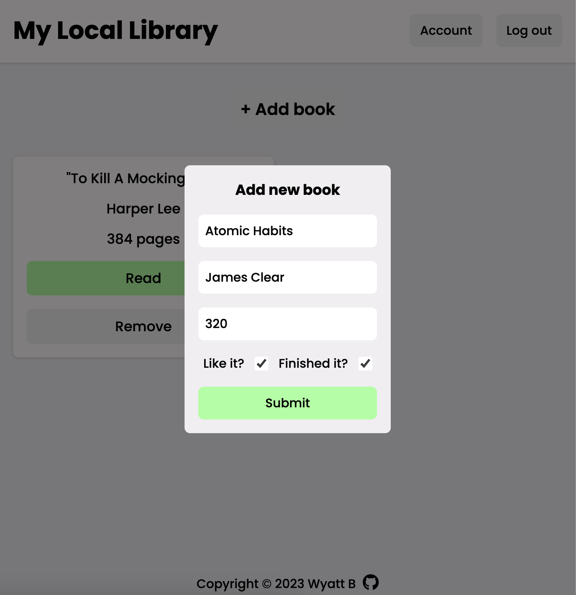
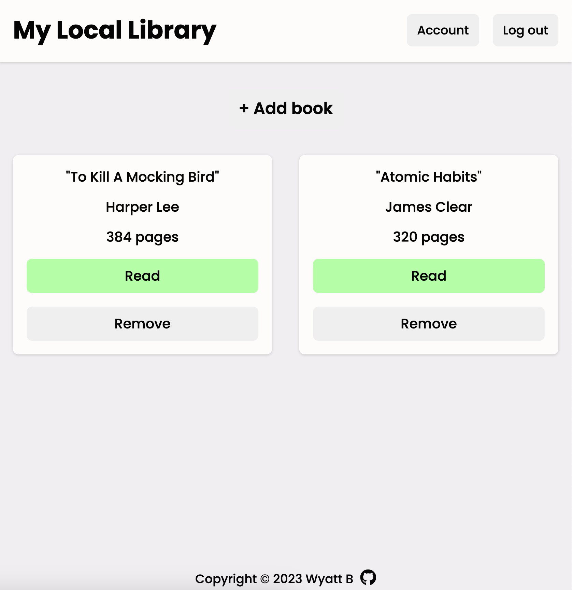

# Library App
* A small library web app using HTML/CSS/JS. 
* User can save their book collection by inputting books one at a time. 
    * User can input: title, author, page count, and if they read the book.

# Demo
* Simply click "+ Add book

